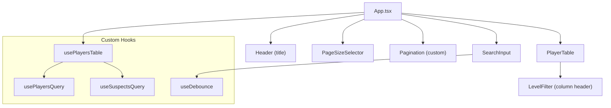
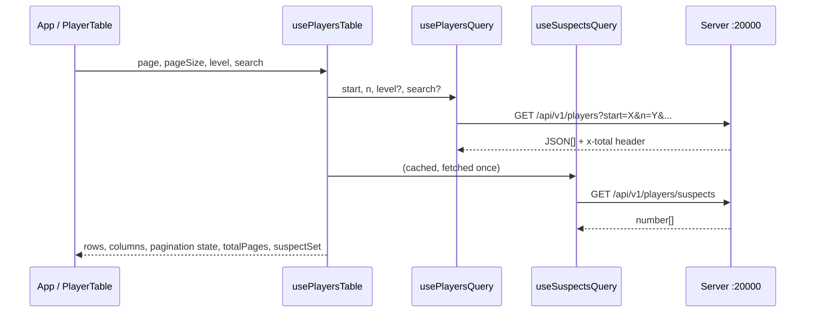

# Tournament Results SPA -- Corrected Plan

## Tech Stack (per cursor rules)

- **Vite** -- build tool (React + TypeScript template), with `base: './'` for relative asset paths
- **React 19** + **TypeScript**
- **TailwindCSS v4** -- all styling via utility classes (no CSS/style tags), wired via the `@tailwindcss/vite` plugin in `vite.config.ts` (no PostCSS config or `tailwind.config.js` needed)
- **TanStack Query v5** (`@tanstack/react-query`) -- server-state / data fetching
- **TanStack Table** (`@tanstack/react-table`) -- table logic
- **clsx** + **tailwind-merge** -- for the `cn()` utility
- No other UI libraries

## Architecture



## Data Flow



## Project Structure

```
src/
  components/
    Header.tsx
    PlayerTable.tsx
    Pagination.tsx
    LevelFilter.tsx
    SearchInput.tsx
    PageSizeSelector.tsx
  hooks/
    usePlayersQuery.ts
    useSuspectsQuery.ts
    usePlayersTable.ts
    useDebounce.ts
  types/
    player.ts
  lib/
    utils.ts              # cn() utility + capitalize()
    api.ts                # fetch wrappers
  App.tsx
  main.tsx
  index.css               # @import "tailwindcss" only (v4 syntax)
index.html
vite.config.ts
tsconfig.json
package.json
```

## Key Implementation Details

### 1. Types (`src/types/player.ts`)

```typescript
export interface Player {
  id: number;
  name: string;
  level: "rookie" | "amateur" | "pro";
  score: number;
}

export type PlayerLevel = Player["level"];

export interface PlayersResponse {
  players: Player[];
  total: number;
}

export interface PlayersQueryParams {
  start: number;
  n: number;
  level?: PlayerLevel;
  search?: string;
}
```

### 2. API Layer (`src/lib/api.ts`)

- `fetchPlayers(params)` -- calls `GET /api/v1/players`, parses JSON body **and** reads the `x-total` response header. Returns `{ players: Player[], total: number }`.
- `fetchSuspects()` -- calls `GET /api/v1/players/suspects`, returns `number[]`.
- Both use plain `fetch()` (no axios needed).

### 3. Custom Hooks

- **`usePlayersQuery(page, pageSize, level?, search?)`** -- wraps `fetchPlayers` in TanStack Query's `useQuery`. Uses `placeholderData: keepPreviousData` (imported from `@tanstack/react-query`, the correct v5 syntax) so pagination doesn't flash. Query key includes all params.
- **`useSuspectsQuery()`** -- wraps `fetchSuspects` in `useQuery` with both `staleTime: Infinity` **and** `gcTime: Infinity` (the suspects list never changes per the spec, and should never be garbage collected).
- **`usePlayersTable()`** -- orchestrates all table state:
  - Manages `pageIndex`, `pageSize` (default 10), `levelFilter`, `searchTerm` as state.
  - Exports `PAGE_SIZE_OPTIONS = [10, 20, 50]` for the PageSizeSelector UI.
  - `handleSearchChange` **explicitly resets pageIndex to 0**.
  - `handleLevelFilterChange` **explicitly resets pageIndex to 0**.
  - `handlePageSizeChange` **explicitly resets pageIndex to 0**.
  - Calls both query hooks.
  - Builds a `Set<number>` of suspect IDs for O(1) lookup.
  - Defines `ColumnDef<Player>[]` with 4 columns (id, name, level, score).
  - Name column cell renders **capitalized** via `capitalize()`.
  - Configures `useReactTable` with `manualPagination: true`, `pageCount` derived from `Math.ceil(total / pageSize)`.
  - Returns everything the UI needs: table instance, pagination helpers, loading/error states, suspect set, and all 3 change handlers.
- **`useDebounce(value, delayMs)`** -- generic debounce hook used by `SearchInput` (300ms delay).

### 4. Components

#### `Header.tsx`

- Displays **"XT tournament - Final results"** as a prominent title with a subtitle.

#### `SearchInput.tsx`

- Controlled text input with debounce (~300ms) before updating the query.
- Accessible: `aria-label`, placeholder text, clear button with `aria-label`.
- On debounced value change, the parent's `handleSearchChange` **explicitly resets pagination to page 0**.
- Escape key clears the search.

#### `LevelFilter.tsx`

- Dropdown rendered inside the Level column header.
- Options: All, Rookie, Amateur, Pro.
- Uses a proper `<label htmlFor="level-filter">` element paired with `<select id="level-filter">` for accessibility (not just `aria-label` alone).
- On change resets pagination to page 0 (via `handleLevelFilterChange`).

#### `PlayerTable.tsx`

- Renders the table using `flexRender()` per cursor rules.
- Semantic HTML: `<table>`, `<thead>`, `<tbody>`, `<tr>`, `<th>`, `<td>`.
- Each row checks if `suspectSet.has(player.id)` -- if yes, applies a **red row background combined with** a "Suspected" **badge with warning icon** in a dedicated **Status column** for immediately obvious visual distinction.
- **Note:** The spec requires "at least 4 columns showing all player's attributes" (id, name, level, score). The Status column is a **5th column added on top** of the required 4, not a replacement. It is clearly labeled "Status" in the `<thead>`.
- Player names rendered with first letter capitalized.
- **Loading state**: spinner with "Loading players..." text.
- **Empty state**: "No players found matching your criteria." message when search/filter returns 0 results.

#### `Pagination.tsx` (custom-built, no library)

- Receives: `currentPage`, `totalPages`, `onPageChange`.
- UI buttons: **[First] [Prev] [page numbers...] [Next] [Last]**
- Page number window: shows ~7 page buttons around the current page with ellipsis for gaps.
- Disabled states for First/Prev when on page 1, Next/Last when on last page.
- Accessible: `aria-label` on all buttons, `aria-current="page"` on active page, keyboard handlers.
- Returns `null` when `totalPages <= 1`.

#### `PageSizeSelector.tsx`

- Small component with a `<label htmlFor="page-size-select">` + `<select id="page-size-select">` for choosing rows per page.
- Options: 10 / 20 / 50 (imported from `PAGE_SIZE_OPTIONS`).
- On change triggers `handlePageSizeChange` which resets to page 0.

### 5. Error Handling

- **Server unreachable / API failure**: When `isError` is true in `App.tsx`, renders a full-screen error card with the error message and a "Reload" button that calls `window.location.reload()`.
- **Empty results**: `PlayerTable` shows a "No players found" message when search/filter yields 0 rows.

### 6. Styling & Responsiveness

- All Tailwind, no CSS files (except `@import "tailwindcss"` in `index.css` -- v4 syntax, not v3's `@tailwind base/components/utilities` directives).
- TailwindCSS v4 does not use `tailwind.config.js`. Any custom theme values (colors, spacing, fonts) go inside `@theme {}` in `index.css`.
- Table uses `overflow-x-auto` wrapper for horizontal scroll on narrow screens.
- Layout is responsive down to 720px -- search bar and filter stack vertically on smaller widths.
- Clean color scheme: white/gray tones, with red accent for suspects (row bg + badge).
- `cn()` utility used throughout for conditional class merging.
- Below the table: PageSizeSelector on the left, Pagination on the right (stacking vertically on mobile).

### 7. Build & Deployment

- **Vite config**: `vite.config.ts` uses `@tailwindcss/vite` plugin (alongside `@vitejs/plugin-react`) to wire TailwindCSS v4. No `postcss.config.js` is needed.
- **Development**: `vite dev` with a proxy in `vite.config.ts` that forwards `/api` requests to `http://localhost:20000` (so the tournament server handles API calls while Vite serves the frontend with HMR).
- **Production**: `vite build` with `base: './'` set in `vite.config.ts` so built assets use **relative paths**, ensuring the server can serve them from its own directory. The built `index.html`, JS, and CSS files are copied into the same folder as the server executable. The server will serve them directly at `http://localhost:20000`.

### 8. Accessibility (per cursor rules)

- All interactive elements have `tabIndex`, `aria-label`, keyboard handlers.
- Table uses semantic elements (`<table>`, `<thead>`, `<tbody>`, `<th>`, `<td>`). 
- Level filter `<select>` uses a proper`<label htmlFor>` element (not just `aria-label`).
- Page size `<select>` uses a proper `<label htmlFor>` element.
- Search input has `aria-label` and clear button has `aria-label`.
- Pagination buttons have descriptive aria-labels (e.g., "Go to page 5") and `aria-current="page"` on the active page.
